# **WEB SOLUTION WITH WORDPRESS**

In this project, we will use RedHat linux distro to implement a basic web solution using WordPress.

## **Steps 1 - Prepare a Web Server**

1. Launch an EC2 instance that will serve as "Web Server". Create 3 volumes in the same availability zone as your Web Server EC2, each of 10 GiB.

2. Attach all three volumes one by one to your Web Server EC2 instance.

[Click here to learn how to add EBS volume to an EC2 instance](https://www.youtube.com/watch?v=HPXnXkBzIHw&ab_channel=dotsway)

3. Open up the Linux terminal to begin configuration. Use `lsblk` command to inspect what block devices are attached to the server. Notice names of your newly created devices. All devices in Linux reside in /dev/ directory. Inspect it with ls /dev/ and make sure you see all 3 newly created block devices there – their names will likely be **xvdf, xvdh, xvdg.**

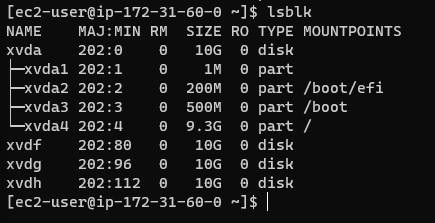

4. Use `df -h` command to see all mounts and free space on your server

5. Use **gdisk** utility to create a single partition on each of the 3 disks

   `sudo gdisk /dev/xvdf`

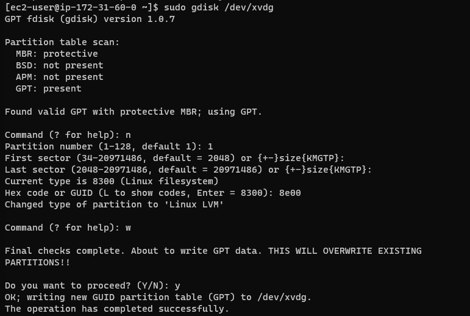

6. Use lsblk utility to view the newly configured partition on each of the 3 disks.


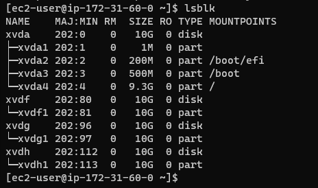

7. Install **lvm2 package** using `sudo yum install lvm2`. 

Run `sudo lvmdiskscan` command to check for available partitions.

8. Use **pvcreate** utility to mark each of 3 disks as physical volumes (PVs) to be used by LVM

    `sudo pvcreate /dev/xvdf1`

    `sudo pvcreate /dev/xvdg1`

    `sudo pvcreate /dev/xvdh1`

9. Verify that your Physical volume has been created successfully by running

 `sudo pvs`

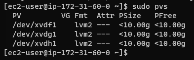

10. Use **vgcreate** utility to add all 3 PVs to a volume group (VG). Name the VG webdata-vg
 
`sudo vgcreate webdata-vg /dev/xvdh1 /dev/xvdg1 /dev/xvdf1`

11. Verify that your VG has been created successfully by running `sudo vgs`

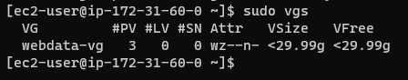

12. Use lvcreate utility to create 2 logical volumes.
     - **apps-lv :** will be used to store data for the Website
     - **logs-lv :** will be used to store data for logs

`sudo lvcreate -n apps-lv -L 14G webdata-vg`

`sudo lvcreate -n logs-lv -L 14G webdata-vg`

13. Verify that your Logical Volume has been created successfully by running `sudo lvs`

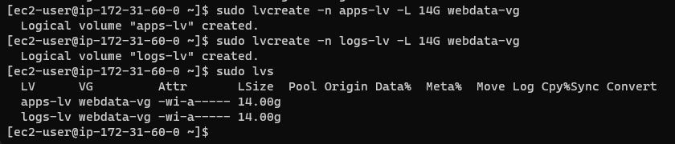

14. Verify the entire setup

`sudo vgdisplay -v #view complete setup - VG, PV, and LV`

`sudo lsblk`

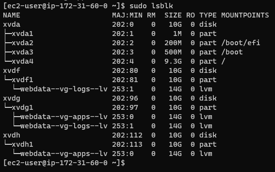

15. Use **mkfs.ext4** to format the logical volumes with ext4 filesystem
 
`sudo mkfs -t ext4 /dev/webdata-vg/apps-lv`

`sudo mkfs -t ext4 /dev/webdata-vg/logs-lv`


16. Create **/var/www/html** directory to store website files
 `sudo mkdir -p /var/www/html`

17. Create **/home/recovery/logs** to store backup of log data
 `sudo mkdir -p /home/recovery/logs`

18. Mount **/var/www/html** on **apps-lv** logical volume
`sudo mount /dev/webdata-vg/apps-lv /var/www/html/`

19. Use **rsync utility** to back up all the files in the log directory /var/log into /home/recovery/logs (This is required before mounting the file system)
 
`sudo rsync -av /var/log/. /home/recovery/logs/`

20. Mount **/var/log** on **logs-lv** logical volume
`sudo mount /dev/webdata-vg/logs-lv /var/log`

21. Restore log files back into /var/log directory
 `sudo rsync -av /home/recovery/logs/. /var/log`

22. Update **/etc/fstab** file so that the mount configuration will persist after restart of the server.

Click on the next button To update the **/etc/fstab file**

## **UPDATE THE /ETC/FSTAB FILE**


The UUID of the device will be used to update the **/etc/fstab** file;

`sudo blkid`

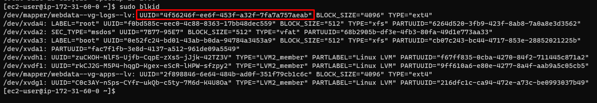

`sudo vi /etc/fstab`

Update **/etc/fstab** in this format using your own UUID and **rememeber to remove the leading and ending quotes**

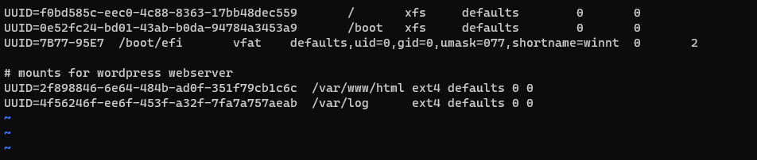

1. Test the configuration and reload the daemon
 
 `sudo mount -a`

 `sudo systemctl daemon-reload`

2. Verify your setup by running `df -h`

Output must look like the image below

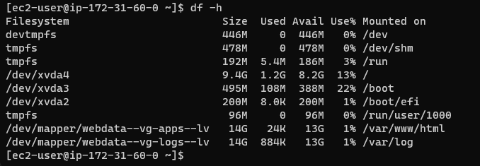

## **Steps 2 - Prepare a Database Server**

Launch a second RedHat EC2 instance and name it **DB Server.** Repeat the same steps as for the Web Server, but instead of **apps-lv** create **db-lv** and mount it to **/db** directory instead of **/var/www/html/.**


## **Steps 3 - Install WordPress on your Web Server EC2**

1. Update the repository
 
`sudo yum -y update`

2. Install wget, Apache and it’s dependencies
 
`sudo yum -y install wget httpd php php-mysqlnd php-fpm php-json`

3. Start Apache

`sudo systemctl enable httpd`

`sudo systemctl start httpd`


4. To install PHP and its dependencies

```
sudo yum install https://dl.fedoraproject.org/pub/epel/epel-release-latest-8.noarch.rpm
sudo yum install yum-utils http://rpms.remirepo.net/enterprise/remi-release-8.rpm
sudo yum module list php
sudo yum module reset php
sudo yum module enable php:remi-7.4
sudo yum install php php-opcache php-gd php-curl php-mysqlnd
sudo systemctl start php-fpm
sudo systemctl enable php-fpm
setsebool -P httpd_execmem 1
```

5. Restart Apache

`sudo systemctl restart httpd`

6. Download wordpress and copy wordpress to **var/www/html**

```
mkdir wordpress
cd   wordpress
sudo wget http://wordpress.org/latest.tar.gz
sudo tar xzvf latest.tar.gz
sudo rm -rf latest.tar.gz
cp wordpress/wp-config-sample.php wordpress/wp-config.php
cp -R wordpress /var/www/html/
```


7. Configure SELinux Policies

```
sudo chown -R apache:apache /var/www/html/wordpress
sudo chcon -t httpd_sys_rw_content_t /var/www/html/wordpress -R
sudo setsebool -P httpd_can_network_connect=1
sudo setsebool -P httpd_can_network_connect_db 1
```

## **Steps 4 - Install MySQL on your DB Server EC2**

Run the commands below:

`sudo yum update`

`sudo yum install mysql-server`

Verify that the service is up and running by using `sudo systemctl status mysqld`, if it is not running, restart the service and enable it so it will be running even after reboot:

`sudo systemctl restart mysqld`

`sudo systemctl enable mysqld`

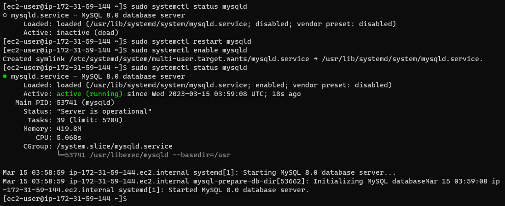

## **Steps 5 - Configure DB to work with WordPress**

```
sudo mysql
CREATE DATABASE wordpress;
CREATE USER `myuser`@`<Web-Server-Private-IP-Address>` IDENTIFIED BY 'mypass';
GRANT ALL ON wordpress.* TO 'myuser'@'<Web-Server-Private-IP-Address>';
FLUSH PRIVILEGES;
SHOW DATABASES;
exit
```

The next thing is to set the **bind address** 

`sudo vi /etc/my.cnf`

```
[mysqld]
bind-address=0.0.0.0
```
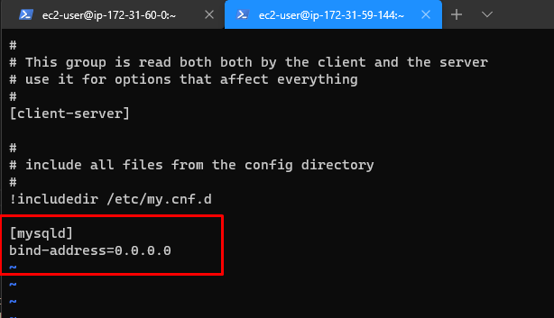

Then restart using `sudo systemctl restart mysqld`

## **Steps 6 - Configure WordPress to connect to the remote database**

Do not forget to open MySQL port 3306 on DB Server EC2. For extra security, you shall allow access to the DB server ONLY from your Web Server’s IP address, so in the Inbound Rule configuration specify source as /32

1. Install MySQL client and test that you can connect from your Web Server to your DB server by using mysql-client

`sudo yum install mysql-server -y`

`start the mysqld service`

`sudo systemctl start mysqld`

`sudo systemctl enable mysqld`

`sudo systemctl status mysqld`

Connect to the database server

`sudo mysql -u admin -p -h <DB-Server-Private-IP-address>`

2. Verify if you can successfully execute `SHOW DATABASES;` command and see a list of existing databases.

3. Change permissions and configuration so Apache could use WordPress

4. Enable TCP port 80 in Inbound Rules configuration for your Web Server EC2 (enable from everywhere 0.0.0.0/0 or from your workstation’s IP)

5. Type the following command and edit the database user, database, password, and host (the private IP of the database server)

`vi wp-config.php`

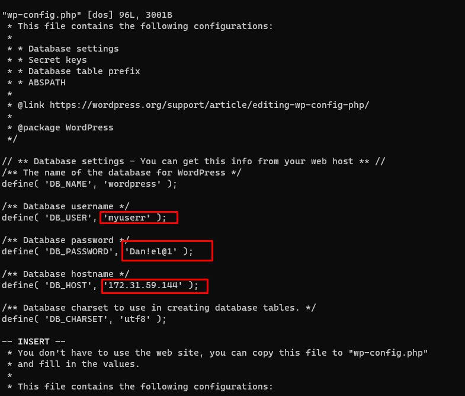

6. `sudo systemctl restart httpd`

7. Disable the httpd welcome page

`mv /etc/httpd/conf.d/welcome.conf /etc/httpd/conf.d/welcome.conf_backup`

8. Try to access from your browser the link to your WordPress 

http://yourwebserverpublicip/wordpress/

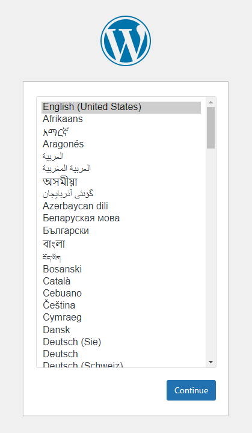

If you see this  – it means your WordPress has successfully connected to your remote MySQL database


